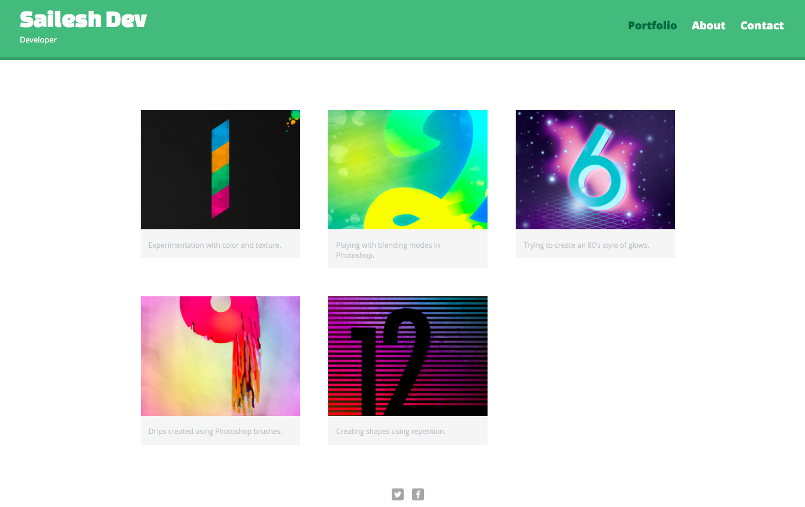
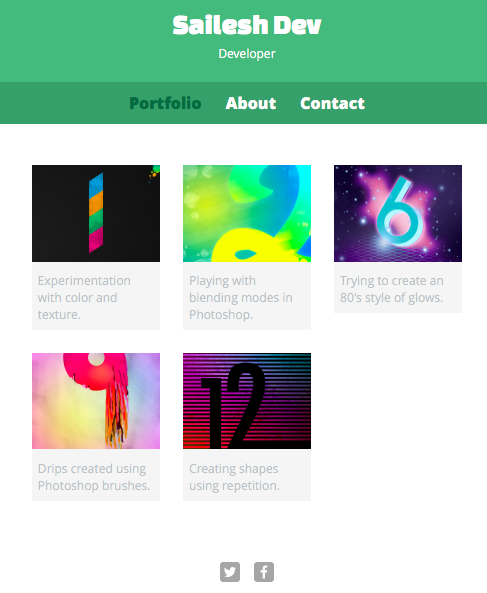

#Responsive HTML Profile template

Sometimes all you want is a really simple HTML profile template to showcase your skills. Here it is!

######It is clean, simple and moreover very responsive

**On large screens:**

**On small screens:**

##Contributing

Contribution is most welcome, that's the whole idea! Together as a community we can build a boilerplate for building responsive sites that will ensure that high standards can be delivered across all devices.   

Please adhere to existing CSS styles though when submitting code and ensure 
that you test thoroughly on multiple devices.

Please take a moment to review the [guidelines for contributing](CONTRIBUTING.md).

* [Bug reports](CONTRIBUTING.md#bugs)
* [Feature requests](CONTRIBUTING.md#features)
* [Pull requests](CONTRIBUTING.md#pull-requests)